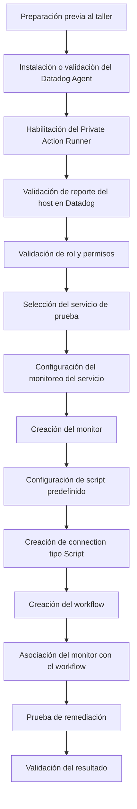
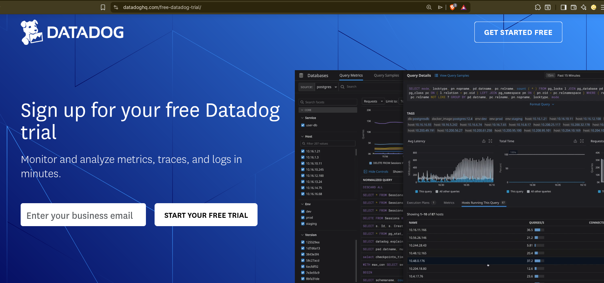
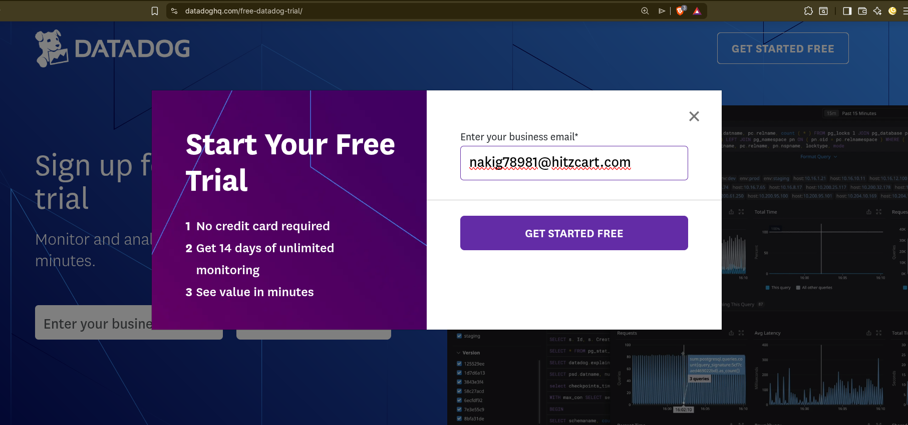
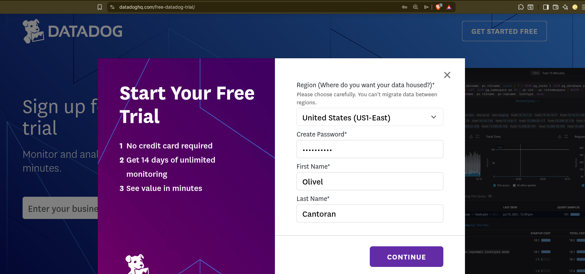
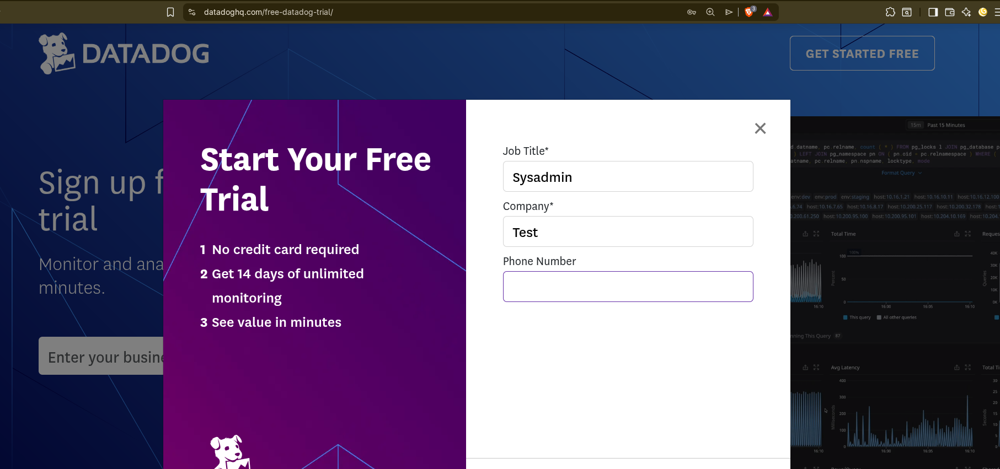
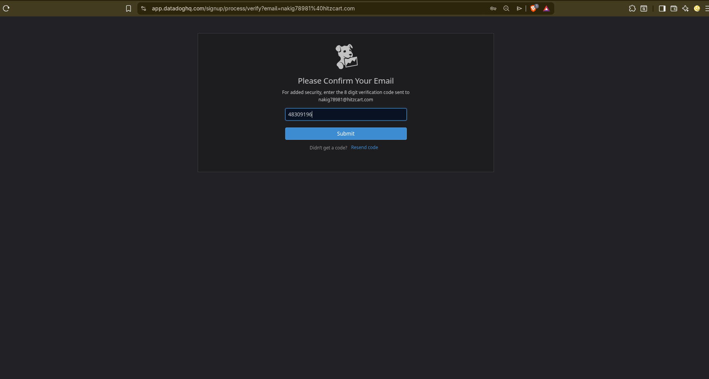
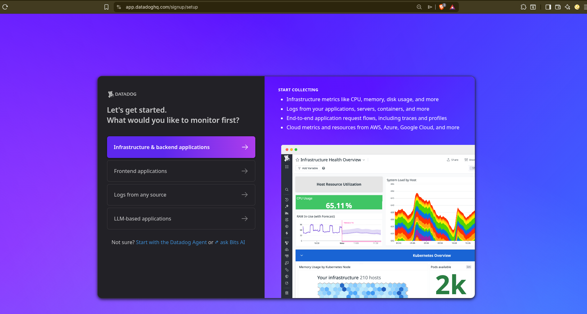
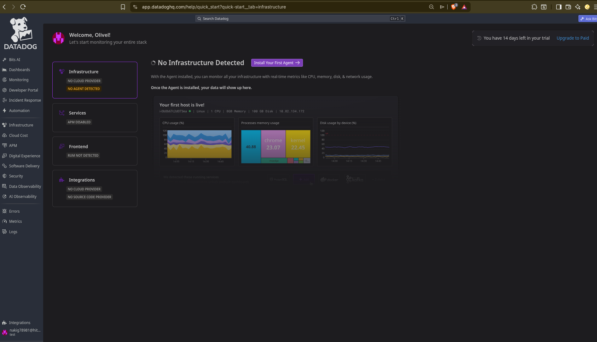
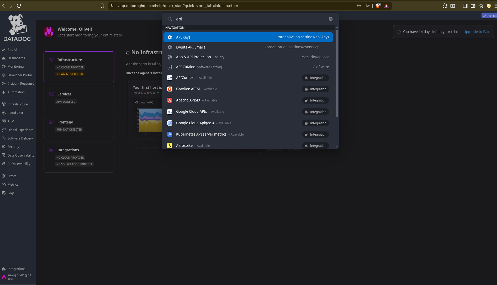

# Manual técnico de taller: Implementación de Workflow Automation en Datadog

## Control del documento

| Campo | Valor |
|---|---|
| Nombre del documento | Manual técnico de taller: Implementación de Workflow Automation en Datadog |
| Versión | 0.1 |
| Estado | Borrador |
| Autor | `<Nombre del autor / equipo>` |
| Fecha | `<AAAA-MM-DD>` |
| Plataforma | Datadog |
| Tipo de documento | Manual técnico de taller |

---

## Índice

- [1. Objetivo](#1-objetivo)
- [2. Alcance](#2-alcance)
- [3. Preparación previa al taller](#3-preparación-previa-al-taller)
- [4. Instalación del Datadog Agent](#4-instalación-del-datadog-agent)
- [5. Validación de reporte en Datadog](#5-validación-de-reporte-en-datadog)
- [6. Validación de rol y permisos en Datadog](#6-validación-de-rol-y-permisos-en-datadog)
- [7. Selección del servicio de prueba](#7-selección-del-servicio-de-prueba)
- [8. Configuración del monitoreo y creación del monitor](#8-configuración-del-monitoreo-y-creación-del-monitor)
- [9. Creación del workflow](#9-creación-del-workflow)
- [10. Asociación del monitor con el workflow](#10-asociación-del-monitor-con-el-workflow)
- [11. Validación de la remediación](#11-validación-de-la-remediación)
- [12. Troubleshooting básico](#12-troubleshooting-básico)
- [13. Desinstalación y limpieza](#13-desinstalación-y-limpieza)
- [14. Bitácora de cambios](#14-bitácora-de-cambios)

---

## 1. Objetivo

Documentar el procedimiento para implementar, de forma guiada, un caso práctico de automatización operativa utilizando Datadog Workflow Automation.

Durante el taller se configurará un escenario controlado en el que Datadog detecta un servicio detenido en un host Linux o Windows, genera una alerta mediante un monitor y ejecuta un workflow para validar el evento y coordinar una acción de remediación controlada.

El objetivo es que los participantes comprendan el flujo completo de implementación, desde la preparación del host y la instalación del Datadog Agent, hasta la creación del monitor, la construcción del workflow y la validación del resultado.

> [!NOTE]
> Este manual está enfocado en un taller práctico de laboratorio. No pretende cubrir todos los posibles casos de uso de Workflow Automation ni sustituir un diseño productivo de automatización.

---

## 2. Alcance

Este manual cubre la implementación básica de Workflow Automation en Datadog para un caso práctico de detección y remediación controlada de servicios en servidores Linux o Windows.

El taller contempla dos niveles de validación:

1. **Flujo base de monitoreo y automatización**

   * Instalación o reutilización del Datadog Agent.
   * Validación de reporte del host en Datadog.
   * Configuración del monitoreo de un servicio del sistema operativo.
   * Creación de un monitor para detectar el servicio detenido.
   * Creación de un workflow disparado por el monitor.
   * Asociación del monitor con el workflow.
   * Validación de que el workflow se ejecuta cuando el monitor entra en alerta.

2. **Flujo de remediación local mediante Private Action Runner**

   * Habilitación del Private Action Runner en el Datadog Agent.
   * Validación de que el runner aparece disponible en Datadog.
   * Creación o validación de una connection de tipo **Script**.
   * Configuración de un script predefinido para iniciar el servicio seleccionado.
   * Ejecución de la remediación desde Workflow Automation.
   * Validación de que el servicio vuelve a estado operativo.

> [!IMPORTANT]
> Para ejecutar scripts locales desde Datadog Workflow Automation no basta con instalar el Datadog Agent.
>
> El host debe tener habilitado el **Private Action Runner**, el runner debe aparecer disponible en Datadog y debe estar asociado a una **connection** de tipo **Script**.
>
> En Windows, la remediación local se realizará mediante PowerShell utilizando la acción permitida `com.datadoghq.script.runPredefinedPowershellScript`.
>
> En Linux, la remediación local se realizará mediante script predefinido utilizando la acción permitida `com.datadoghq.script.runPredefinedScript`.

El procedimiento contempla:

* Uso de una cuenta de prueba u organización Datadog disponible.
* Instalación o reutilización del Datadog Agent.
* Habilitación del Private Action Runner cuando se requiera remediación local.
* Configuración del monitoreo de un servicio del sistema operativo.
* Creación de un monitor para detectar el servicio detenido.
* Creación de un workflow de remediación controlada.
* Asociación del monitor con el workflow.
* Configuración de una connection de tipo Script.
* Validación del flujo completo de monitoreo, automatización y remediación.
* Revisión básica del resultado de la ejecución.

Este manual **no contempla**:

* Implementaciones productivas avanzadas.
* Diseño avanzado de dashboards, SLOs, logs, trazas o APM.
* Automatizaciones complejas con aprobaciones, múltiples ramas o integraciones externas.
* Administración completa de servicios Linux o Windows.
* Troubleshooting profundo del Datadog Agent o de Workflow Automation fuera del caso práctico del taller.
* Remediación sobre servicios críticos o productivos.
* Uso de scripts dinámicos que permitan ejecutar cualquier comando recibido desde el workflow.

> [!WARNING]
> La remediación local debe limitarse a scripts predefinidos y controlados. No se recomienda permitir comandos amplios, parámetros libres o acciones que puedan modificar servicios no contemplados en el taller.

> [!IMPORTANT]
> El taller debe realizarse en un ambiente controlado. No se recomienda ejecutar la primera prueba sobre servidores productivos, servicios críticos o componentes necesarios para el acceso remoto al host.

Ruta resumida del taller:



---

## 3. Preparación previa al taller

Antes del taller, se recomienda completar esta preparación inicial para evitar consumir tiempo durante la sesión práctica. El objetivo es llegar con una cuenta de Datadog activa, una API key disponible y un host listo para instalar o reutilizar el Datadog Agent.

### 3.1 Crear cuenta de Datadog

Para realizar el taller se requiere una cuenta de Datadog. Si aún no se cuenta con una, se debe crear una cuenta de prueba desde el portal oficial de [Datadog Free Trial](https://www.datadoghq.com/free-datadog-trial/).

Pasos generales:

1. Ingresar al portal de prueba de Datadog.

   

2. En el campo **Enter your business email**, capturar el correo que se utilizará para el taller.

   

3. Seleccionar **Get Started Free**.

4. En el formulario de registro, seleccionar la región:

   ```text
   United States (US1-East)
   ```

   Esta selección es importante porque define el sitio de Datadog que se utilizará más adelante para configurar el Agent.

   Para este taller, la región **United States (US1-East)** corresponde al siguiente valor de configuración:

   ```yaml
   site: datadoghq.com
   ```

5. Crear una contraseña para la cuenta.

6. Capturar nombre y apellido.

   

7. Completar los datos adicionales solicitados por el formulario.

   | Campo | Valor sugerido para el taller |
   |---|---|
   | Job Title | `Sysadmin`, `DevOps`, `SRE` o rol equivalente |
   | Company | Nombre de la empresa o un valor de laboratorio, por ejemplo `Test` |
   | Phone Number | Número de contacto, **ESTE VALOR ES OPCIONAL** |

   

8. Seleccionar **Create Account**.

9. Confirmar el correo electrónico mediante el código de verificación enviado por Datadog.

   

10. Después de confirmar el correo, Datadog puede mostrar una pantalla inicial de onboarding con la pregunta:

   ```text
   What would you like to monitor first?
   ```

   

12. Para este taller, no es necesario seleccionar una opción en esa pantalla. En su lugar, abrir directamente la consola principal de Datadog desde la siguiente URL:

   ```text
   https://app.datadoghq.com/
   ```

   Esto permite entrar a la cuenta ya creada sin continuar con el asistente inicial de onboarding.

13. Validar que se puede acceder correctamente a la consola de Datadog con la cuenta creada.

   

14. Guardar los datos básicos que se utilizarán durante el taller.

| Dato | Valor |
|---|---|
| Correo utilizado | `<correo_del_taller>` |
| Región seleccionada | `United States (US1-East)` |
| Site del Agent | `datadoghq.com` |
| API key | `<API_KEY_DEL_TALLER>` |

> [!NOTE]
> La pantalla de onboarding inicial no representa un error. Datadog la muestra para guiar la primera instalación o configuración. Para este taller, la instalación del Agent se realizará de forma controlada en la sección [4. Instalación del Datadog Agent](#4-instalación-del-datadog-agent), por lo que se recomienda acceder directamente a la consola principal mediante `https://app.datadoghq.com/`.

> [!IMPORTANT]
> Para este taller se utilizará la región **United States (US1-East)**. Esta región corresponde al valor `site: datadoghq.com`, que se usará durante la instalación o configuración del Datadog Agent.

> [!WARNING]
> No se recomienda utilizar correos temporales para el taller. Si se pierde acceso al correo utilizado, puede ser más difícil recuperar la cuenta o continuar con actividades posteriores.

### 3.2 Obtener API key

La API key será necesaria para instalar o configurar el Datadog Agent. Esta llave permite que el Agent envíe información desde el host hacia la cuenta de Datadog utilizada en el taller.

Para ubicar rápidamente la sección de API keys dentro de Datadog, se puede utilizar el buscador de la plataforma:

```text
Ctrl + K
```

En el buscador, escribir:

```text
API Keys
```

Pasos generales:

1. Iniciar sesión en Datadog.
2. Presionar `Ctrl + K`.
3. Buscar **API Keys**.
4. Entrar a la sección de API keys.
5. Crear una nueva API key o utilizar una API key existente autorizada.
6. Guardar la API key de forma segura.



> [!IMPORTANT]
> La API key debe tratarse como información sensible. No debe compartirse en repositorios públicos, capturas de pantalla, chats abiertos o documentación sin protección.

### 3.2.1 Application Key para Private Action Runner

Además de la API key del Datadog Agent, para usar **Private Action Runner** se requiere una **Application Key**.

La diferencia es la siguiente:

| Llave | Uso |
|---|---|
| API key | Permite que el Datadog Agent reporte información del host hacia Datadog. |
| Application Key | Permite que el Private Action Runner se registre y pueda ejecutar acciones privadas desde Workflow Automation. |

Durante la instalación del Agent, esta Application Key puede generarse automáticamente al habilitar la opción:

```text
Enable Agent to take action
```

> [!IMPORTANT]
> No confundir la API key con la Application Key.
>
> Si el `app_key` no es válido, el Private Action Runner puede iniciar localmente, pero no aparecer como disponible en Datadog.

> [!WARNING]
> La API key y la Application Key deben tratarse como información sensible. No deben compartirse en capturas, repositorios o documentación sin protección.


### 3.3 Preparar workstation para el taller

Para el taller, cada participante utilizará su propia workstation Linux o Windows para instalar o reutilizar el Datadog Agent.

Antes de continuar, se deben validar los siguientes puntos:

| Requisito | Descripción |
|---|---|
| Sistema operativo | Contar con una workstation Linux o Windows. |
| Permisos locales | Tener permisos suficientes para instalar software, modificar configuraciones y reiniciar servicios. |
| Acceso a internet | Contar con salida a internet para acceder a Datadog y descargar el Datadog Agent. |
| Acceso a Datadog | Poder iniciar sesión en `https://app.datadoghq.com/`. |
| API key | Tener disponible la API key generada en la sección anterior. |
| Site | Para este taller se utilizará `datadoghq.com`. |
| Terminal disponible | Contar con terminal Linux o PowerShell en Windows para ejecutar comandos de validación. |

Validar acceso a la consola de Datadog:

```text
https://app.datadoghq.com/
```

Validar salida a internet desde la workstation:

#### Linux

```bash
curl -I https://app.datadoghq.com/
```

#### Windows PowerShell

```powershell
Invoke-WebRequest -Uri "https://app.datadoghq.com/" -UseBasicParsing
```

Si la workstation aún no tiene Datadog Agent instalado, la instalación se realizará en la siguiente sección.

Si la workstation ya tiene Datadog Agent instalado, se validará durante el taller si puede reutilizarse o si es necesario ajustar su configuración.

---

## 4. Instalación del Datadog Agent

En esta sección se instalará el Datadog Agent en la workstation que se utilizará durante el taller.

Además de instalar el Agent para reportar información básica del host, se habilitará la opción **Enable Agent to take action**, ya que el workflow utilizará el Agent como mecanismo autorizado para ejecutar una acción de remediación mediante **Private Action Runner**.

Si la workstation ya tiene el Agent instalado y autorizado para usar la API key del taller, se puede omitir la reinstalación del Agent. Antes de continuar, validar que el Agent reporte correctamente y que tenga habilitado **Private Action Runner**, como se indica en la sección [5. Validación de reporte y Private Action Runner](#5-validación-de-reporte-y-private-action-runner).


Para este taller se utilizarán los siguientes valores:

```yaml
site: datadoghq.com
api_key: <API_KEY_DEL_TALLER>
app_key: <APP_KEY_PRIVATE_ACTION_RUNNER>
```

Selecciona la ruta correspondiente al sistema operativo:

| Sistema operativo | Ruta de instalación                                       |
| ----------------- | --------------------------------------------------------- |
| Linux             | [Ir a instalación en Linux](#41-instalación-en-linux)     |
| Windows           | [Ir a instalación en Windows](#42-instalación-en-windows) |

---

### 4.1 Instalación en Linux

Para Linux se utilizará el instalador generado desde Datadog. Si se requiere validar compatibilidad o detalles adicionales, consultar la guía de [Datadog Agent para Linux](https://docs.datadoghq.com/agent/supported_platforms/linux/).

Pasos generales:

1. Iniciar sesión en Datadog.

2. Presionar `Ctrl + K`.

3. Buscar:

   ```text
   install agent
   ```

4. Seleccionar **Install Agents**.

5. En la sección **Host based**, seleccionar **Linux**.

6. Validar que el comando generado utilice:

   ```text
   DD_SITE="datadoghq.com"
   ```

7. Seleccionar la API key correspondiente al taller.

8. Habilitar la opción **Enable Agent to take action**.

9. Copiar la Application Key generada para el Private Action Runner.

10. Validar que el comando generado incluya la habilitación del Private Action Runner.

Para este taller, la allowlist debe permitir la ejecución de scripts predefinidos en Linux:

```text
com.datadoghq.script.runPredefinedScript
```

Ejemplo de referencia:

```bash
DD_API_KEY="<API_KEY_DEL_TALLER>" \
DD_APP_KEY="<APP_KEY_PRIVATE_ACTION_RUNNER>" \
DD_SITE="datadoghq.com" \
DD_PRIVATE_ACTION_RUNNER_ENABLED=true \
DD_PRIVATE_ACTION_RUNNER_ACTIONS_ALLOWLIST="com.datadoghq.script.runPredefinedScript" \
bash -c "$(curl -L https://install.datadoghq.com/scripts/install_script_agent7.sh)"
```

11. Ejecutar el comando en la workstation Linux con permisos administrativos.

Validar que el servicio esté activo:

```bash
sudo systemctl status datadog-agent
```

Validar el estado general del Agent:

```bash
sudo datadog-agent status
```

### 4.2 Instalación en Windows

Para Windows se utilizará el instalador generado desde Datadog. Si se requiere validar compatibilidad o detalles adicionales, consultar la guía de [Datadog Agent para Windows](https://docs.datadoghq.com/agent/supported_platforms/windows/).

Pasos generales:

1. Iniciar sesión en Datadog.

2. Presionar `Ctrl + K`.

3. Buscar:

   ```text
   install agent
   ```

4. Seleccionar **Install Agents**.

5. En la sección **Host based**, seleccionar **Windows**.

6. Utilizar la opción **PowerShell**, marcada como recomendada por Datadog.

> [!NOTE]
> La opción **PowerShell** es la recomendada para el taller porque permite instalar el Agent con la API key, el site y la configuración del Private Action Runner definidos desde el mismo comando.

También puede utilizarse la opción **MSI** cuando se prefiera una instalación gráfica, cuando la política de la workstation no permita ejecutar comandos de instalación desde PowerShell o cuando el equipo de soporte solicite utilizar un instalador manual.

7. Validar que el comando generado utilice:

   ```powershell
   $env:DD_SITE = 'datadoghq.com'
   ```

8. Seleccionar la API key correspondiente al taller.

9. Habilitar la opción **Enable Agent to take action**.

10. Copiar la Application Key generada para el Private Action Runner.

11. Validar que el comando generado incluya la habilitación del Private Action Runner.

Para este taller, la allowlist debe permitir la ejecución de scripts predefinidos en Windows:

```text
com.datadoghq.script.runPredefinedPowershellScript
```

Ejemplo de referencia:

```powershell
$env:DD_API_KEY = '<API_KEY_DEL_TALLER>';
$env:DD_APP_KEY = '<APP_KEY_PRIVATE_ACTION_RUNNER>';
$env:DD_SITE = 'datadoghq.com';
$env:DD_PRIVATE_ACTION_RUNNER_ENABLED = 'true';
$env:DD_PRIVATE_ACTION_RUNNER_ACTIONS_ALLOWLIST = 'com.datadoghq.script.runPredefinedPowershellScript';
```

12. Copiar el comando completo generado por Datadog.

13. Ejecutar el comando desde una sesión de **PowerShell como administrador**.


#### Posible bloqueo por Smart App Control en Windows

Durante la instalación en Windows, puede aparecer un bloqueo de **Smart App Control** indicando que Windows no puede confirmar quién publicó la aplicación o que no reconoce el instalador.

Este bloqueo puede impedir que se ejecute el instalador del Datadog Agent, aunque el comando haya sido generado desde Datadog. Para continuar con la instalación, se puede desactivar **Smart App Control** desde la configuración de seguridad de Windows.

Pasos para desactivarlo:

1. Abrir **Windows Security**.

2. Entrar a:

   ```text
   App & browser control
   ```

3. Seleccionar:

   ```text
   Smart App Control settings
   ```

4. Cambiar **Smart App Control** a:

   ```text
   Off
   ```

5. Confirmar el cambio si Windows solicita autorización.

6. Cerrar la ventana donde se bloqueó el instalador.

7. Abrir nuevamente **PowerShell como administrador**.

8. Ejecutar nuevamente el comando completo generado por Datadog.

> [!WARNING]
> No deshabilitar Windows Defender completo ni el firewall como primera opción. El bloqueo observado corresponde a **Smart App Control**.

Validar que el servicio esté en ejecución:

```powershell
Get-Service datadogagent
```

Validar el estado general del Agent:

```powershell
& "C:\Program Files\Datadog\Datadog Agent\bin\agent.exe" status
```
### 4.3 Validación del Private Action Runner

Después de instalar el Agent, validar que el Private Action Runner haya quedado registrado en Datadog.

Pasos generales:

1. En Datadog, presionar `Ctrl + K`.

2. Buscar:

   ```text
   Private Action Runners
   ```

3. Abrir la sección correspondiente.

4. Validar que aparezca un runner asociado a la workstation del taller.

5. Confirmar que el runner se encuentre disponible para ser utilizado por workflows.

> [!WARNING]
> El Private Action Runner solo debe permitir las acciones necesarias para el taller. No se recomienda habilitar acciones adicionales si no serán utilizadas durante la práctica.

Validación adicional desde la workstation:

#### Linux

```bash
sudo datadog-agent status | grep -A 10 -i "Private Action Runner"
```

Revisar el log del Private Action Runner:

```bash
sudo tail -n 100 /var/log/datadog/private-action-runner.log
```

#### Windows PowerShell

```powershell
& "C:\Program Files\Datadog\Datadog Agent\bin\agent.exe" status |
Select-String -Pattern "Private Action Runner|URN|Self Enroll|Actions Allowlist|Remote Configuration" -Context 0,8
```

En Windows, también se puede revisar el log específico del runner:

```powershell
Get-Content "C:\ProgramData\Datadog\logs\private-action-runner.log" -Tail 100 |
Select-String -Pattern "Private action runner starting|URN|runner_id|Keys manager ready|Starting loop|401|error validating JWT"
```

El resultado esperado es que el runner aparezca disponible en Datadog y que no se observen errores de autenticación como:

```text
401 error validating JWT
```

> [!IMPORTANT]
> En Windows no se utilizará el script tipo Linux/bash.
>
> Si existe un script de ejemplo o configuración previa asociada a `runPredefinedScript`, no se debe usar para esta prueba, puede ser eliminada.
>
> La configuración correcta para Windows se agregará más adelante usando PowerShell mediante `runPredefinedPowershellScript`.

---

## 5. Validación de reporte en Datadog

En esta sección se validará que la workstation donde se instaló el Datadog Agent ya se encuentre reportando información hacia Datadog.

Antes de continuar, identifica el nombre de la workstation.

#### Linux

```bash
hostname
```

#### Windows PowerShell

```powershell
hostname
```

Con ese nombre, validar el reporte desde la consola de Datadog.

### 5.1 Validar reporte del host en Datadog

Pasos generales:

1. Iniciar sesión en Datadog.

2. Presionar `Ctrl + K`.

3. Buscar:

   ```text
   Hosts
   ```

4. Entrar a **Hosts**.

5. Buscar el nombre de la workstation.

6. Confirmar que la workstation aparece en la lista de hosts.

> [!NOTE]
> Después de instalar o reiniciar el Datadog Agent, la workstation puede tardar algunos minutos en aparecer en Datadog.

> [!IMPORTANT]
> Si la workstation no aparece en Datadog, si el Agent muestra errores críticos, revisar la sección [12. Troubleshooting básico](#12-troubleshooting-básico).

---

## 6. Validación de rol y permisos en Datadog

Antes de crear monitores, workflows o connections, se debe validar qué rol tiene asignado el usuario dentro de Datadog y qué permisos incluye ese rol.

Esta validación no consiste en crear todavía un monitor, workflow o connection. Es una revisión previa para confirmar si el usuario cuenta con permisos suficientes para continuar con las actividades prácticas del taller.

Si la cuenta fue creada específicamente para el taller, normalmente el usuario tendrá permisos suficientes para avanzar. Si se utiliza una cuenta existente o compartida, se debe revisar el rol asignado mediante la configuración de usuarios y roles de Datadog.

Para este taller también se debe considerar que el workflow utilizará **Private Actions** mediante el **Private Action Runner** habilitado en el Datadog Agent. Por lo tanto, además de validar permisos para monitores y workflows, se deben revisar permisos relacionados con actions, runners y llaves de aplicación.

### 6.1 Validar rol asignado al usuario

Desde la consola de Datadog:

1. Presionar `Ctrl + K`.

2. Buscar:

   ```text
   Users
   ```

3. Entrar a la sección de usuarios.

4. Buscar el usuario utilizado para el taller.

5. Revisar el rol asignado al usuario.

6. Desde el rol asignado, seleccionar la opción para ir al detalle del rol.

   En la interfaz puede aparecer como:

   ```text
   Go to role details
   ```

Esto permite abrir directamente el rol asociado al usuario y revisar qué permisos tiene habilitados.

### 6.2 Revisar permisos del rol

Dentro del detalle del rol, se puede revisar la lista de permisos disponibles.

También es posible utilizar el buscador de permisos para localizar permisos relacionados con las actividades del taller.

Permisos o capacidades que se deben validar de forma general:

| Actividad del taller             | Validación esperada                                                                      |
| -------------------------------- | ---------------------------------------------------------------------------------------- |
| Consultar hosts                  | Poder ver la workstation en **Infrastructure > Hosts**.                                  |
| Crear monitores                  | Tener permisos para crear o editar monitores.                                            |
| Crear workflows                  | Tener permisos relacionados con **Workflow Automation**.                                 |
| Configurar connections           | Tener permisos para consultar o configurar connections, si el caso práctico lo requiere. |
| Usar API key                     | Tener disponible la API key generada para instalar el Agent.                             |
| Usar Application Key             | Tener disponible la Application Key utilizada por el Private Action Runner.              |
| Usar Private Actions             | Tener permisos para ejecutar acciones privadas desde workflows.                          |
| Consultar Private Action Runners | Poder validar que el runner del Agent aparece disponible en Datadog.                     |

Para facilitar la revisión, se pueden buscar permisos relacionados con los siguientes términos:

```text
monitor
workflow
connection
action
runner
api key
application key
```

### 6.3 Consideraciones

Si el usuario tiene un rol como **Datadog Admin Role**, normalmente contará con permisos suficientes para completar el taller.

Si el usuario tiene un rol limitado, personalizado o de solo lectura, puede que no pueda crear monitores, workflows, connections, Application Keys o ejecutar Private Actions.

En ambientes con roles personalizados, se debe confirmar que el usuario tenga permisos suficientes para realizar las siguientes actividades:

* Crear y editar el monitor del servicio.
* Crear y editar el workflow de remediación.
* Asociar el workflow al monitor.
* Validar el Private Action Runner.
* Utilizar la acción privada que ejecutará el script predefinido.
* Consultar o utilizar la API key y Application Key definidas para el taller.

Para ambientes con roles personalizados, se puede consultar la referencia de [Datadog Role Permissions](https://docs.datadoghq.com/account_management/rbac/permissions/).

> [!IMPORTANT]
> Si el usuario no puede ver el Private Action Runner, crear workflows o seleccionar acciones privadas dentro del workflow, se debe revisar el rol asignado antes de continuar con la práctica.

---

## 7. Selección del servicio de prueba

En esta sección se seleccionará el servicio que se utilizará para simular una condición de falla durante el taller.

El servicio elegido debe existir en la workstation, poder detenerse e iniciarse manualmente y no representar un riesgo para la operación del sistema operativo.

El nombre exacto del servicio seleccionado se utilizará posteriormente en la configuración del monitor y en la acción de remediación ejecutada desde Workflow Automation.

Selecciona la ruta correspondiente:

| Sistema operativo | Ruta de validación                                                                      |
| ----------------- | --------------------------------------------------------------------------------------- |
| Linux             | [Ir a validación de servicios en Linux](#72-validar-servicios-disponibles-en-linux)     |
| Windows           | [Ir a validación de servicios en Windows](#73-validar-servicios-disponibles-en-windows) |

> [!IMPORTANT]
> Los servicios listados en esta sección son únicamente sugerencias. Cada participante debe validar qué servicios tiene disponibles en su workstation y elegir uno con base en su criterio técnico y conocimiento del sistema operativo.

### 7.1 Criterios de selección

El servicio seleccionado debe cumplir con lo siguiente:

* Existir en la workstation.
* Poder detenerse e iniciarse sin afectar funciones críticas.
* Poder administrarse localmente mediante comandos del sistema operativo.
* No estar relacionado con red, autenticación, seguridad, antivirus, firewall, cifrado o acceso remoto.
* Ser adecuado para una prueba controlada de monitoreo y remediación.

> [!CAUTION]
> No utilizar servicios críticos del sistema operativo ni servicios productivos. La prueba debe realizarse con un servicio de bajo impacto.

### 7.2 Validar servicios disponibles en Linux

En Linux, se pueden listar los servicios administrados por `systemd` con el siguiente comando:

```bash
systemctl list-units --type=service --all
```

Para validar un servicio específico:

```bash
systemctl status <nombre_del_servicio>
```

Ejemplo:

```bash
systemctl status cups.service
```

También se puede validar si el servicio se encuentra activo:

```bash
systemctl is-active cups.service
```

Servicios sugeridos, si están disponibles:

| Servicio       | Comentario                                                        |
| -------------- | ----------------------------------------------------------------- |
| `cups.service` | Servicio de impresión. Usar solo si no afecta la operación local. |

> [!NOTE]
> En Linux se debe utilizar el nombre completo del servicio administrado por `systemd`, por ejemplo `cups.service`.

### 7.3 Validar servicios disponibles en Windows

En Windows, se pueden listar los servicios desde PowerShell:

```powershell
Get-Service | Sort-Object DisplayName
```

Para validar un servicio específico:

```powershell
Get-Service -Name <nombre_del_servicio>
```

Ejemplo:

```powershell
Get-Service -Name Spooler
```

También se puede buscar por nombre visible:

```powershell
Get-Service | Where-Object {$_.DisplayName -like "*Spooler*"}
```

Servicios sugeridos, si están disponibles:

| Service name | Nombre visible común | Comentario                                                        |
| ------------ | -------------------- | ----------------------------------------------------------------- |
| `Spooler`    | Print Spooler        | Usar solo si existe y no se requiere impresión durante la prueba. |

> [!NOTE]
> En Windows se debe utilizar el **service name** para la configuración técnica. El nombre visible puede ser diferente. Por ejemplo, el servicio puede mostrarse como `Print Spooler`, pero su service name suele ser `Spooler`.

---

## 8. Configuración del monitoreo y creación del monitor

En esta sección se configurará el monitoreo del servicio seleccionado y se creará el monitor que detectará cuando el servicio se encuentre detenido.

Selecciona la ruta correspondiente al sistema operativo:

| Sistema operativo | Ruta |
|---|---|
| Linux | [Ir a configuración en Linux](#81-configuración-del-monitoreo-en-linux) |
| Windows | [Ir a configuración en Windows](#82-configuración-del-monitoreo-en-windows) |
| Monitor | [Ir a creación del monitor](#83-creación-del-monitor-de-service-check) |

### 8.1 Configuración del monitoreo en Linux

Para Linux se utilizará la integración de [Systemd](https://docs.datadoghq.com/integrations/systemd/), la cual permite monitorear unidades administradas por `systemd`.

Datadog normalmente incluye un archivo `.example` con ejemplos de configuración. Para el taller no será necesario copiar todo ese contenido; se utilizará una configuración mínima con el servicio seleccionado.

Crear o editar el archivo:

```bash
sudo vi /etc/datadog-agent/conf.d/systemd.d/conf.yaml
```

Agregar la configuración mínima:

```yaml
init_config:

instances:
  - unit_names:
      - <SERVICIO_LINUX>
    substate_status_mapping:
      <SERVICIO_LINUX>:
        running: ok
        exited: critical
        dead: critical
        failed: critical
        stopped: critical
        unknown: critical
```

Ejemplo:

```yaml
init_config:

instances:
  - unit_names:
      - cups.service
    substate_status_mapping:
      cups.service:
        running: ok
        exited: critical
        dead: critical
        failed: critical
        stopped: critical
        unknown: critical
```

Reiniciar el Datadog Agent:

```bash
sudo systemctl restart datadog-agent
```

Validar el check:

```bash
sudo -u dd-agent datadog-agent check systemd
```

El check debe ejecutarse sin errores críticos y debe mostrar información relacionada con la unidad configurada.

### 8.2 Configuración del monitoreo en Windows

Para Windows se utilizará la integración de **Windows Service**, la cual permite monitorear servicios del sistema operativo.

Datadog normalmente incluye un archivo `.example` con ejemplos de configuración. Para el taller no será necesario copiar todo ese contenido; se utilizará una configuración mínima con el servicio seleccionado.

Crear o editar el archivo:

```powershell
notepad "C:\ProgramData\Datadog\conf.d\windows_service.d\conf.yaml"
```

Agregar la configuración mínima:

```yaml
init_config:

instances:
  - services:
      - ^<SERVICIO_WINDOWS>$
    disable_legacy_service_tag: true
```

Ejemplo:

```yaml
init_config:

instances:
  - services:
      - ^Spooler$
    disable_legacy_service_tag: true
```

> [!NOTE]
> En Windows se debe utilizar el **service name**, no necesariamente el nombre visible del servicio.
> 
> Por ejemplo, el servicio puede mostrarse como `Print Spooler`, pero su service name suele ser `Spooler`.

> [!NOTE]
> La opción `disable_legacy_service_tag: true` evita el warning relacionado con la etiqueta heredada `service`, ya que el check utiliza la etiqueta `windows_service` para identificar el servicio monitoreado.

Reiniciar el Datadog Agent:

```powershell
Restart-Service -Name datadogagent -Force
```

Validar el check:

```powershell
& "C:\Program Files\Datadog\Datadog Agent\bin\agent.exe" check windows_service
```

El check debe ejecutarse sin errores críticos y debe mostrar información relacionada con el servicio configurado.

---

### 8.3 Creación del monitor de Service Check

Una vez que el Agent ya reporta el estado del servicio, se debe crear un monitor de tipo [Service Check](https://docs.datadoghq.com/monitors/types/service_check/).

Desde Datadog:

1. Presionar `Ctrl + K`.
2. Buscar `New Monitor`.
3. Seleccionar **Service Check**.
4. En **Pick a Service Check**, seleccionar el check correspondiente:

| Sistema operativo | Service Check |
|---|---|
| Linux | `systemd.unit.state` |
| Windows | `windows_service.state` |

5. En **Pick monitor scope**, seleccionar el host y el servicio utilizados en el taller.
6. En **Set alert conditions**, utilizar **Check Alert**.
7. Configurar la alerta para estado `Critical`.
8. En **Trigger a separate alert for each**, seleccionar el grupo por el cual Datadog generará alertas separadas.

   Para el taller, seleccionar la opción que corresponda al sistema operativo y al tipo de agrupación deseada:

> [!NOTE]
> En Windows, si se configuró `disable_legacy_service_tag: true`, se debe utilizar `windows_service` en lugar de `service`.

9. Configurar la recuperación para estado `OK`.

10. En el nombre del monitor, utilizar una estructura similar:
```text
[Workshop] Servicio detenido - {{host.name}} - {{service.name}}
```

10. En el mensaje del monitor, utilizar una estructura similar:

```text
{{#is_alert}}
Se detectó que el servicio monitoreado se encuentra detenido.

Host: {{host.name}}
Servicio: {{service.name}}
Detalle: {{check_message}}

Este monitor forma parte del taller de Datadog Workflow Automation.
{{/is_alert}}

{{#is_recovery}}
El servicio monitoreado volvió a estado OK.

Host: {{host.name}}
Servicio: {{service.name}}
Detalle: {{check_message}}
{{/is_recovery}}
```

11. Guardar el monitor.

### 8.4 Validación del monitor

Para validar el monitor:

1. Detener manualmente el servicio seleccionado.
2. Esperar a que el Datadog Agent ejecute nuevamente el check.
3. Confirmar que el monitor cambia a estado de alerta.
4. Iniciar nuevamente el servicio.
5. Confirmar que el monitor vuelve a estado `OK`.

#### Linux

```bash
sudo systemctl stop <SERVICIO_LINUX>
sudo systemctl start <SERVICIO_LINUX>
```

#### Windows PowerShell

```powershell
Stop-Service -Name <SERVICIO_WINDOWS>
Start-Service -Name <SERVICIO_WINDOWS>
```

> [!CAUTION]
> Solo detener servicios previamente seleccionados como seguros para el taller.

---

## 9. Creación del workflow

En esta sección se creará el workflow que será ejecutado cuando el monitor detecte el servicio detenido.

El workflow utilizará el **Monitor Trigger** como disparador y ejecutará una acción de remediación mediante el **Private Action Runner** configurado previamente en el Datadog Agent.

El flujo general será:

```text
Monitor detecta servicio detenido
Workflow Automation se ejecuta
Private Action Runner ejecuta script predefinido
Workflow espera algunos minutos
Workflow consulta nuevamente el estado del monitor
Workflow valida si el monitor regresó a OK
```

> [!IMPORTANT]
> Workflow Automation coordina la automatización, pero no debe entenderse como un agente remoto genérico para ejecutar cualquier comando sobre el servidor. Para este taller, la remediación se realizará únicamente mediante scripts predefinidos y permitidos en el Private Action Runner.

### 9.1 Configurar script predefinido en el Private Action Runner

Antes de crear el workflow, se debe definir el script que el Private Action Runner podrá ejecutar.

Este script será el encargado de iniciar nuevamente el servicio seleccionado en la sección anterior.

Selecciona la ruta correspondiente al sistema operativo:

| Sistema operativo | Ruta                                                                                      |
| ----------------- | ----------------------------------------------------------------------------------------- |
| Linux             | [Ir a configuración del script en Linux](#911-configurar-script-predefinido-en-linux)     |
| Windows           | [Ir a configuración del script en Windows](#912-configurar-script-predefinido-en-windows) |

> [!IMPORTANT]
> Si el archivo ya contiene contenido de ejemplo, hacer un backup y reemplazar todo el contenido del archivo por la configuración del taller.

### 9.1.1 Configurar script predefinido en Linux

Editar el archivo de configuración de scripts del Private Action Runner:

Antes de modificar el archivo, generar un respaldo:

```bash
sudo cp /etc/datadog-agent/private-action-runner/script-config.yaml /etc/datadog-agent/private-action-runner/script-config.yaml.bak-$(date +%Y%m%d-%H%M%S)
```

Después, limpiar el contenido actual del archivo y reemplazarlo por la configuración del taller:


```bash
sudo vi /etc/datadog-agent/private-action-runner/script-config.yaml
```

Si el archivo contiene ejemplos como echo, helloWorld o scripts de prueba, eliminarlos para dejar únicamente el script que se utilizará en el taller.

Agregar una configuración similar, reemplazando `<SERVICIO_LINUX>` por el servicio seleccionado:

```yaml
schemaId: script-credentials-v1
runPredefinedScript:
  start_selected_service:
    command:
      - /bin/bash
      - -c
      - |
        sudo /usr/bin/systemctl start <SERVICIO_LINUX> && echo "<SERVICIO_LINUX> iniciado correctamente"
        /usr/bin/systemctl is-active <SERVICIO_LINUX>
```

Ejemplo:

```yaml
schemaId: script-credentials-v1
runPredefinedScript:
  start_selected_service:
    command:
      - /bin/bash
      - -c
      - |
        sudo /usr/bin/systemctl start cups.service && echo "cups.service iniciado correctamente"
        /usr/bin/systemctl is-active cups.service

```

Si el comando requiere privilegios, permitir únicamente el comando necesario para el usuario del Agent:

```bash
echo "dd-agent ALL=(root) NOPASSWD: /usr/bin/systemctl start <SERVICIO_LINUX>" | sudo tee /etc/sudoers.d/dd-agent-workshop
sudo chmod 440 /etc/sudoers.d/dd-agent-workshop
```

Ejemplo:

```bash
echo "dd-agent ALL=(root) NOPASSWD: /usr/bin/systemctl start cups.service" | sudo tee /etc/sudoers.d/dd-agent-workshop
sudo chmod 440 /etc/sudoers.d/dd-agent-workshop
```

Reiniciar el Datadog Agent para que el Private Action Runner tome la configuración:

```bash
sudo systemctl restart datadog-agent
```

> [!WARNING]
> No se recomienda permitir comandos amplios como `systemctl *` o scripts que acepten cualquier servicio como parámetro. Para el taller, el script debe limitarse al servicio seleccionado.

#### 9.1.2 Configurar script predefinido en Windows

Editar el archivo de configuración de scripts de PowerShell del Private Action Runner:

```powershell
notepad "C:\ProgramData\Datadog\private-action-runner\powershell-script-config.yaml"
```


Agregar una configuración similar, reemplazando `<SERVICIO_WINDOWS>` por el servicio seleccionado:

```yaml
schemaId: script-credentials-v1
runPredefinedPowershellScript:
  startSelectedService:
    script: |
      Start-Service -Name "<SERVICIO_WINDOWS>"
      Write-Output "Start requested for service <SERVICIO_WINDOWS>"
```

Ejemplo:

```yaml
schemaId: script-credentials-v1
runPredefinedPowershellScript:
  startSelectedService:
    script: |
      Start-Service -Name "Spooler"
      Write-Output "Start requested for service Spooler"
```

Guardar el archivo y reiniciar el Datadog Agent para que el Private Action Runner tome la configuración:

```powershell
Restart-Service -Name datadogagent -Force
```

Después de reiniciar el Agent, no se probará la connection de tipo **Script** desde el botón **Test** cuando el sistema operativo sea Windows.

En Windows, ese test puede mostrar el siguiente mensaje:

    Testing script connection is not available on Windows

Esto no invalida la configuración. La prueba real se realizará más adelante desde el workflow usando la action:

    Run Predefined PowerShell Script

La connection de tipo **Script** debe conservarse, porque será utilizada por la action de PowerShell.

También puede ocurrir que el runner aparezca como `Inactive` en la vista de detalle. Para este taller, la validación funcional se confirmará cuando el workflow ejecute correctamente la action de PowerShell.

#### Permisos para ejecución del script en Windows

En Windows, el script será ejecutado por el usuario del Datadog Agent, normalmente `ddagentuser`.

Si la remediación requiere iniciar o reiniciar un servicio, se debe otorgar permiso sobre el servicio seleccionado para el taller.

Para esta prueba se otorgarán permisos únicamente sobre el servicio definido en la variable `$ServiceName`.

```powershell
$ServiceName = "Spooler"
$AgentUser = "$env:COMPUTERNAME\ddagentuser"
$BackupPath = "C:\ProgramData\Datadog\workshop-service-sddl-$ServiceName.txt"

$sid = (New-Object System.Security.Principal.NTAccount($AgentUser)).Translate([System.Security.Principal.SecurityIdentifier]).Value
$currentSd = sc.exe sdshow $ServiceName | Where-Object { $_ -match '^D:' }

$currentSd | Out-File -FilePath $BackupPath -Encoding ascii -Force

$ace = "(A;;LCRPWPLO;;;$sid)"

if ($currentSd -notmatch [regex]::Escape($sid)) {
    if ($currentSd -match "S:") {
        $newSd = $currentSd -replace "S:", "${ace}S:"
    } else {
        $newSd = "$currentSd$ace"
    }

    sc.exe sdset $ServiceName $newSd
}
```

Validar nuevamente la ejecución desde el workflow.

Si al finalizar el taller se requiere quitar estos permisos, consultar la sección [13.2.2 Remover permisos del servicio en Windows](#1322-remover-permisos-del-servicio-en-windows).

Referencia oficial:
- [Datadog Windows Agent User](https://docs.datadoghq.com/agent/guide/windows-agent-ddagent-user/)
- [Microsoft: Service Security and Access Rights](https://learn.microsoft.com/en-us/windows/win32/services/service-security-and-access-rights)


### 9.2 Validar connection de Script asociada al Private Action Runner

El workflow utilizará una connection de tipo **Script** asociada al **Private Action Runner** de la workstation.

Esta connection será utilizada más adelante por la action del workflow para ejecutar el script correspondiente al sistema operativo:

| Sistema operativo | Action del workflow |
|---|---|
| Linux | Run Predefined Script |
| Windows | Run Predefined PowerShell Script |

Desde la consola de Datadog:

1. Presionar `Ctrl + K`.

2. Buscar:

   ```text
   Connections
   ```

3. Entrar a **Connections** dentro de **Action Catalog**.

4. Filtrar por la integración:

   ```text
   Script
   ```

5. Confirmar que exista una connection de tipo **Script** asociada al Private Action Runner de la workstation.

6. Validar que la connection esté vinculada al runner correcto.

En Linux, si el botón **Test** está disponible, puede utilizarse como validación adicional.

En Windows, no se utilizará el botón **Test** de la connection. La validación se realizará posteriormente desde el workflow usando la action:

```text
Run Predefined PowerShell Script
```

Si no aparece una connection de tipo **Script**, validar primero que el Private Action Runner esté disponible y que la acción correspondiente esté permitida en la configuración del Agent.

### 9.3 Buscar Workflow Automation

Desde la consola de Datadog:

1. Presionar `Ctrl + K`.

2. Buscar:

   ```text
   Workflow Automation
   ```

3. Seleccionar **Workflow Automation** para abrir el módulo.

---

### 9.4 Crear workflow con Monitor Trigger

Dentro de **Workflow Automation**:

1. Seleccionar **New Workflow**.

2. En la pantalla inicial del workflow, ubicar la sección **Or start with a Trigger**.

3. Seleccionar **Monitor**.

4. Asignar un nombre al workflow.

   Nombre sugerido:

   ```text
   [Workshop] Remediación de servicio detenido
   ```

5. Confirmar que el trigger seleccionado sea **Monitor**.

6. Crear el workflow.

> [!NOTE]
> La asociación final entre el monitor y el workflow se realizará en la sección [10. Asociación del monitor con el workflow](#10-asociación-del-monitor-con-el-workflow).

---

### 9.5 Agregar action para ejecutar el script predefinido

Después de crear el workflow con el **Monitor Trigger**, agregar la action que ejecutará la remediación.

Selecciona la ruta correspondiente al sistema operativo:

| Sistema operativo | Action |
|---|---|
| Linux | [Run Predefined Script](#951-agregar-action-en-linux) |
| Windows | [Run Predefined PowerShell Script](#952-agregar-action-en-windows) |

---

#### 9.5.1 Agregar action en Linux

1. Dar clic en el ícono **+** debajo del trigger **Monitor**.

2. Seleccionar **All Actions**.

3. En el buscador de actions, escribir:

   ```text
   script
   ```

4. Seleccionar la action:

   ```text
   Run Predefined Script
   ```

5. Seleccionar la connection de tipo **Script** asociada al Private Action Runner.

6. Seleccionar el script configurado previamente en:

   ```text
   /etc/datadog-agent/private-action-runner/script-config.yaml
   ```

   El nombre del script debe coincidir exactamente con el definido en el archivo de configuración.

7. Guardar la configuración del paso.

---

#### 9.5.2 Agregar action en Windows

1. Dar clic en el ícono **+** debajo del trigger **Monitor**.

2. Seleccionar **Actions**.

3. En el buscador de actions, escribir:

   ```text
   script
   ```

4. Seleccionar la action:

   ```text
   Run Predefined PowerShell Script
   ```

5. Seleccionar la connection de tipo **Script** asociada al Private Action Runner.

6. Seleccionar el script configurado previamente en:

   ```text
   C:\ProgramData\Datadog\private-action-runner\powershell-script-config.yaml
   ```

   El nombre del script debe coincidir exactamente con el definido en el archivo de configuración.

7. Guardar la configuración del paso.

> [!IMPORTANT]
> Para este taller, el workflow solo debe ejecutar la remediación del servicio seleccionado. No se deben agregar acciones adicionales innecesarias.

---

### 9.6 Agregar espera después de la remediación

Después de ejecutar la action de remediación, agregar una pausa para permitir que el servicio inicie y que el Agent reporte nuevamente el estado.

Pasos generales:

1. Dar clic en el ícono **+** debajo de la action de remediación.

2. Seleccionar **All Actions**.

3. Buscar una action de lógica:

   ```text
   Sleep
   ```

4. Seleccionar la action de espera.

5. Configurar una espera de referencia:

   ```text
   5 minutos
   ```

El tiempo puede ajustarse según la frecuencia del check configurado en el Agent y el tiempo esperado para que el servicio vuelva a reportar estado correcto.


---

### 9.7 Consultar nuevamente el estado del monitor

Después de la espera, agregar una action para consultar nuevamente el estado del monitor.

Pasos generales:

1. Dar clic en el ícono **+** debajo de la action **Sleep**.

2. Seleccionar **All Actions**.

3. En el buscador de actions, escribir:

   ```text
   monitor
   ```

4. Buscar la action:

   ```text
   Get monitor
   ```

5. Seleccionar la action para consultar los detalles del monitor.

6. Asignar un nombre al paso:

   ```text
   Recheck Monitor
   ```

7. Configurar el ID del monitor.

   Para el taller se puede usar el ID del monitor creado para la prueba.

   Si está disponible la variable del trigger, también se puede utilizar:

   ```text
   {{ Source.monitor.id }}
   ```

8. Guardar la configuración del paso.

---

### 9.8 Agregar condición de recuperación

Después de consultar nuevamente el monitor, agregar una condición para validar si el monitor regresó a estado OK.

Pasos generales:

1. Dar clic en el ícono **+** debajo de **Recheck Monitor**.

2. Seleccionar **All Actions**.

3. Buscar y seleccionar la action de condición:

   ```text
   If condition
   ```

4. Asignar un nombre al paso:

   ```text
   Monitor Recovered Condition
   ```

5. Configurar la condición usando el resultado de **Recheck Monitor**:

   **Statement**

   ```text
   {{ Steps.Recheck_Monitor.overall_state }}
   ```

   **Operator**

   ```text
   =
   ```

   **Value**

   ```text
   OK
   ```

---

### 9.9 Registrar el resultado en Notebook

Después de la condición, agregar una actualización al Notebook para dejar evidencia del resultado del workflow.

Para este taller se utilizará un Notebook existente como bitácora. El Notebook debe crearse una sola vez y después el workflow lo actualizará en cada ejecución.

Crear el Notebook previamente desde Datadog:

1. Presionar `Ctrl + K`.

2. Buscar:

   ```text
   Notebooks
   ```

3. Crear un Notebook para el taller.

   Nombre sugerido:

   ```text
   [Workshop] Workflow remediation log
   ```

4. Copiar el **Notebook ID**, ya que será utilizado en las actions de actualización.

---

### 9.9.1 Agregar actualización de Notebook en la rama True

En la rama **True**, agregar una action para registrar que la remediación fue exitosa y que el monitor regresó a estado `OK`.

Nombre sugerido para la action:

```text
Notebook Update Success
```

1. Configurar el **Timeframe** requerido por la action.

   Para el taller se puede usar:

   ```text
   Last 1 hour
   ```

2. Configurar el **Notebook ID** correspondiente al Notebook creado para el taller.

3. En el campo **Cells**, agregar una celda tipo Markdown con el siguiente contenido:

```json
[
  {
    "attributes": {
      "definition": {
        "text": "## Workflow remediation report\n\n**Monitor:** {{ Source.monitor.name }}\n**Host:** {{ Source.monitor.event.host }}\n**Current state:** {{ Steps.Recheck_Monitor.overall_state }}\n**Timestamp:** {{ Source.monitor.event.date_happened }}\n\nAutomated remediation executed successfully and the monitor is now OK.\n",
        "type": "markdown"
      }
    },
    "type": "notebook_cells"
  }
]
```

4. Configurar el campo obligatorio **Name**.

   Puede colocarse el mismo nombre del Notebook utilizado para el taller:

   ```text
   [Workshop] Workflow remediation log
   ```

   También puede usarse una variable si el nombre viene de un paso anterior:

   ```text
   {{ Steps.Notebook_Start.name }}
   ```

5. Mantener el campo **Status** como:

   ```text
   published
   ```

6. Guardar la configuración del paso.

Con esta configuración, cuando la condición sea **True**, el workflow agregará una entrada al Notebook indicando que la remediación fue exitosa y que el monitor regresó a `OK`.

#### 9.9.2 Agregar actualización de Notebook en la rama False

En la rama **False**, agregar una action para registrar el resultado no exitoso.

Pasos generales:

1. Dar clic en el ícono **+** de la rama **False**.

2. Seleccionar **All Actions**.

3. En el buscador de actions, escribir:

   ```text
   notebook
   ```

4. Seleccionar la action:

   ```text
   Update notebook
   ```

5. Asignar un nombre al paso:

   ```text
   Notebook Update Failure
   ```

6. Configurar el **Timeframe** requerido por la action.

   Para el taller se puede usar:

   ```text
   Last 1 hour
   ```

7. Configurar el **Notebook ID** correspondiente al Notebook creado para el taller.

8. En el campo **Cells**, agregar una celda tipo Markdown con el siguiente contenido:

   ```json
   [
     {
       "attributes": {
         "definition": {
           "text": "## Workflow remediation report\n\n**Monitor:** {{ Source.monitor.name }}\n**Host:** {{ Source.monitor.event.host }}\n**Current state:** `{{ Steps.Recheck_Monitor.overall_state }}`\n**Timestamp:** {{ Source.monitor.event.date_happened }}\n\nAutomated remediation was executed, but the monitor did not return to `OK`. Manual review is required.\n",
           "type": "markdown"
         }
       },
       "type": "notebook_cells"
     }
   ]
   ```

9. Configurar el campo obligatorio **Name**.

   Se puede usar el nombre del Notebook creado al inicio del flujo:

   ```text
   {{ Steps.Notebook_Start.name }}
   ```

   O colocar directamente el nombre del Notebook:

   ```text
   [Workshop] Workflow remediation log
   ```

10. Mantener el campo **Status** como:

```text
published
```

11. Guardar la configuración del paso.

---

### 9.10 Guardar y publicar el workflow

Cuando el flujo esté completo:

1. Revisar que el trigger **Monitor** esté conectado con la action de remediación.

2. Confirmar que la action de remediación utilice la connection de tipo **Script**.

3. Confirmar que exista una espera después de la remediación.

4. Confirmar que exista la consulta posterior del monitor.

5. Confirmar que exista la condición de recuperación.

6. Confirmar que ambas ramas registren el resultado en el Notebook.

7. Guardar el workflow.

8. Publicar el workflow.

> [!IMPORTANT]
> El workflow debe estar publicado para poder ejecutarse automáticamente desde el monitor.

Con esto, el workflow queda preparado para asociarse al monitor creado previamente.

---

## 10. Asociación del monitor con el workflow

En esta sección se asociará el monitor creado previamente con el workflow de remediación.

> [!IMPORTANT]
> El workflow debe estar publicado antes de asociarlo al monitor. Si el workflow no está publicado, no podrá ejecutarse automáticamente cuando el monitor entre en alerta.

---

### 10.1 Buscar el monitor

Desde la consola de Datadog:

1. Presionar `Ctrl + K`.

2. Buscar:

   ```text
   Monitors
   ```

3. Entrar a **Monitors**.

4. Buscar el monitor creado para el servicio seleccionado.

5. Abrir el monitor.

6. Seleccionar **Edit**.

---

### 10.2 Agregar workflow al monitor

Dentro de la edición del monitor:

1. Ir a la sección **Configure notifications & automations**.

2. Seleccionar **Add Workflow**.

3. Buscar el workflow creado en la sección anterior.

4. Seleccionar el workflow.

5. Guardar los cambios del monitor.

> [!NOTE]
> Si el workflow no aparece en la lista, validar que tenga configurado un **Monitor Trigger** y que se encuentre publicado.

---

### 10.3 Guardar y validar la asociación

Después de agregar el workflow al monitor:

1. Guardar el monitor.

2. Volver a abrir el monitor.

3. Revisar la sección **Configure notifications & automations**.

4. Confirmar que el workflow aparece asociado al monitor.

5. Confirmar que el monitor conserva su mensaje de alerta y recuperación.

> [!IMPORTANT]
> Cada vez que el monitor dispare el workflow publicado, se generará una ejecución del workflow. Durante las pruebas, se recomienda evitar detener e iniciar el servicio repetidamente sin validar primero el estado del monitor y del workflow.

---

## 11. Validación de la remediación

En esta sección se validará el flujo completo: detener el servicio de prueba, esperar la alerta del monitor, confirmar la ejecución del workflow y revisar si la remediación controlada inició nuevamente el servicio.

> [!IMPORTANT]
> La prueba debe realizarse únicamente sobre el servicio de bajo impacto seleccionado para el taller.

---

### 11.1 Detener el servicio de prueba

Selecciona la ruta correspondiente:

| Sistema operativo | Ruta de validación                                |
| ----------------- | ------------------------------------------------- |
| Linux             | [Ir a prueba en Linux](#1111-prueba-en-linux)     |
| Windows           | [Ir a prueba en Windows](#1112-prueba-en-windows) |

---

#### 11.1.1 Prueba en Linux

Detener el servicio seleccionado:

```bash
sudo systemctl stop cups.service
```

Validar que el servicio quedó detenido:

```bash
systemctl status cups.service
```

También se puede validar únicamente el estado activo del servicio:

```bash
systemctl is-active cups.service
```

> [!NOTE]
> Reemplazar `cups.service` por el servicio seleccionado para el taller.

---

#### 11.1.2 Prueba en Windows

Detener el servicio seleccionado:

```powershell
Stop-Service -Name Spooler
```

Validar que el servicio quedó detenido:

```powershell
Get-Service -Name Spooler
```

> [!NOTE]
> Reemplazar `Spooler` por el servicio seleccionado para el taller.

---

### 11.2 Validar alerta del monitor

Después de detener el servicio, esperar a que Datadog reciba el nuevo estado y el monitor cambie a condición de alerta.

Desde Datadog:

1. Presionar `Ctrl + K`.

2. Buscar:

   ```text
   Monitors
   ```

3. Entrar a **Monitors**.

4. Abrir el monitor creado para el taller.

5. Validar que el monitor cambió a estado de alerta.

6. Confirmar que el host y el servicio corresponden a la prueba.

> [!NOTE]
> El cambio de estado puede tardar algunos minutos, dependiendo del intervalo de recolección del Agent y de la configuración del monitor.

---

### 11.3 Validar ejecución del workflow

Una vez que el monitor entra en alerta, se debe validar que el workflow asociado se ejecutó.

Desde Datadog:

1. Presionar `Ctrl + K`.

2. Buscar:

   ```text
   Workflow Automation
   ```

3. Entrar a **Workflow Automation**.

4. Abrir el workflow creado para el taller.

5. Revisar el historial de ejecuciones.

6. Abrir la última **workflow execution**.

7. Validar que la ejecución corresponda al evento generado por el monitor.

Dentro de la ejecución del workflow, revisar que las actions principales hayan finalizado correctamente.

Si alguna action aparece con error, abrir el detalle de la action antes de repetir la prueba.

---

### 11.4 Validar estado final del servicio

Después de la ejecución del workflow, validar si el servicio fue iniciado nuevamente.

#### Linux

```bash
systemctl status cups.service
```

También se puede validar con:

```bash
systemctl is-active cups.service
```

El servicio debe regresar a estado activo.

#### Windows PowerShell

```powershell
Get-Service -Name Spooler
```

El servicio debe regresar a estado `Running`.

> [!NOTE]
> Reemplazar `cups.service` o `Spooler` por el servicio seleccionado para el taller.

---

### 11.5 Validar recuperación del monitor

Después de confirmar que el servicio volvió a estar activo, validar que el monitor también regrese a estado `OK`.

Desde Datadog:

1. Presionar `Ctrl + K`.

2. Buscar:

   ```text
   Monitors
   ```

3. Abrir el monitor del taller.

4. Confirmar que el monitor regresó a estado `OK`.

5. Revisar el historial del monitor para confirmar la transición de alerta a recuperación.

> [!NOTE]
> La recuperación del monitor puede tardar algunos minutos, dependiendo de la frecuencia del check y de la evaluación configurada en el monitor.

---

### 11.6 Consideraciones si la remediación no funciona

Si el servicio no se recupera, no repetir la prueba de forma indefinida.

Revisar en este orden:

1. Detalle de la **workflow execution**.
2. Resultado de la action **Run Predefined Script** o **Run Predefined PowerShell Script**.
3. Estado del **Private Action Runner**.
4. Connection de tipo **Script**.
5. Permisos del usuario del Agent.
6. Configuración del script predefinido.
7. Logs del Datadog Agent.

> [!WARNING]
> Si el servicio permanece detenido, iniciarlo manualmente solo después de capturar la evidencia necesaria para el troubleshooting.

---

## 12. Troubleshooting básico

Esta sección contiene validaciones básicas para identificar problemas comunes durante el taller.

---

### 12.1 El Agent no inicia

Validar el estado del servicio.

#### Linux

```bash
sudo systemctl status datadog-agent
sudo journalctl -u datadog-agent -n 50 --no-pager
```

También se puede revisar el log principal del Agent:

```bash
sudo tail -n 50 /var/log/datadog/agent.log
```

#### Windows PowerShell

```powershell
Get-Service datadogagent
```

También se puede revisar el log principal del Agent:

```powershell
Get-Content "C:\ProgramData\Datadog\logs\agent.log" -Tail 50
```

Si el servicio no inicia, revisar que el archivo `datadog.yaml` tenga los valores correctos:

```yaml
api_key: <API_KEY_DEL_TALLER>
site: datadoghq.com
```

Puntos a revisar:

* API key correcta.
* Site configurado como `datadoghq.com`.
* Sintaxis válida en `datadog.yaml`.
* Conectividad hacia Datadog.
* Permisos del servicio del Agent.
* Errores recientes en los logs del Agent.

---

### 12.2 El host no aparece en Datadog

Validar que el Agent esté en ejecución y que no existan errores de conexión o autenticación.

#### Linux

```bash
sudo datadog-agent status
```

#### Windows PowerShell

```powershell
& "C:\Program Files\Datadog\Datadog Agent\bin\agent.exe" status
```

Puntos a revisar:

* API key correcta.
* Site configurado como `datadoghq.com`.
* Conectividad del host hacia Datadog.
* Firewall, proxy o restricciones de red.
* Tiempo de espera después de instalar o reiniciar el Agent.
* Errores de autenticación o conexión en la salida del comando `status`.

---

### 12.3 El Private Action Runner no aparece o queda inactivo

Si el host aparece en Datadog pero el **Private Action Runner** no está disponible, queda inactivo o no puede usarse desde el workflow, revisar la configuración utilizada durante la instalación del Agent.

Desde Datadog:

1. Presionar `Ctrl + K`.

2. Buscar:

   ```text
   Private Action Runners
   ```

3. Validar si aparece el runner asociado a la workstation del taller.

Puntos a revisar:

* Que se haya habilitado **Enable Agent to take action** durante la instalación.
* Que se haya utilizado una **Application Key** válida en `app_key`.
* Que la Application Key tenga permisos para Private Actions.
* Que `remote_configuration` esté habilitado.
* Que el Agent haya sido reiniciado después de la configuración.
* Que no existan errores relacionados con el runner en los logs.

#### Linux

Validar estado del runner:

```bash
sudo datadog-agent status | grep -A 10 -i "Private Action Runner"
```

Revisar logs:

```bash
sudo tail -n 100 /var/log/datadog/private-action-runner.log
sudo tail -n 50 /var/log/datadog/agent.log
```

#### Windows PowerShell

Validar estado del runner:

```powershell
& "C:\Program Files\Datadog\Datadog Agent\bin\agent.exe" status |
Select-String -Pattern "Private Action Runner|URN|Self Enroll|Actions Allowlist|Remote Configuration" -Context 0,8
```

Revisar logs:

```powershell
Get-Content "C:\ProgramData\Datadog\logs\private-action-runner.log" -Tail 100 |
Select-String -Pattern "Private action runner starting|URN|Keys manager ready|Starting loop|401|error validating JWT"
```

Si en Windows el runner inicia pero aparece el error:

```text
401 error validating JWT
```

puede existir una identidad local inválida del runner. Para forzar un nuevo enrolamiento, ejecutar PowerShell como administrador:

```powershell
Stop-Service -Name datadogagent -Force

$timestamp = Get-Date -Format "yyyyMMdd-HHmmss"
$identityFile = "C:\ProgramData\Datadog\privateactionrunner_private_identity.json"

if (Test-Path $identityFile) {
    Copy-Item $identityFile "$identityFile.bak-$timestamp" -Force
    Remove-Item $identityFile -Force
}

Start-Service -Name datadogagent
```

Después de reiniciar el Agent, validar nuevamente que el runner aparezca en:

```text
Private Action Runners
```
---

### 12.4 El servicio no reporta estado

Validar que la integración del servicio esté configurada correctamente.

#### Linux

```bash
sudo -u dd-agent datadog-agent check systemd
```

Archivo a revisar:

```text
/etc/datadog-agent/conf.d/systemd.d/conf.yaml
```

Puntos a revisar:

* El servicio existe en el sistema operativo.
* El nombre del servicio está escrito correctamente.
* El archivo `conf.yaml` tiene sintaxis válida.
* El Agent fue reiniciado después del cambio.
* El check `systemd` se ejecuta sin errores críticos.

#### Windows PowerShell

```powershell
& "C:\Program Files\Datadog\Datadog Agent\bin\agent.exe" check windows_service
```

Archivo a revisar:

```text
C:\ProgramData\Datadog\conf.d\windows_service.d\conf.yaml
```

Puntos a revisar:

* El servicio existe en Windows.
* Se está usando el **service name** y no solo el nombre visible.
* El archivo `conf.yaml` tiene sintaxis válida.
* El Agent fue reiniciado después del cambio.
* El check `windows_service` se ejecuta sin errores críticos.

---

### 12.5 El monitor no cambia a alerta

Si el servicio ya fue detenido pero el monitor no cambia de estado, revisar:

* Que el check correcto esté asociado al monitor.
* Que el scope apunte al host correcto.
* Que el scope incluya el servicio correcto.
* Que el Agent esté enviando datos recientes.
* Que el check del servicio esté reportando correctamente.
* Que haya pasado el tiempo suficiente para que Datadog evalúe la condición.
* Que el monitor esté configurado para alertar cuando el service check esté en estado `Critical`.

Checks esperados según el sistema operativo:

```text
Linux: systemd.unit.state
Windows: windows_service.state
```

---

### 12.6 El workflow no se ejecuta

Si el monitor entra en alerta pero el workflow no se ejecuta, validar:

* Que el workflow esté publicado.
* Que el workflow tenga configurado un **Monitor Trigger**.
* Que el monitor tenga asociado el workflow en **Configure notifications & automations**.
* Que el monitor realmente haya cambiado a estado de alerta.
* Que el workflow asociado sea el correcto.
* Que no se haya asociado una versión anterior o no publicada del workflow.

Desde Datadog:

1. Presionar `Ctrl + K`.

2. Buscar:

   ```text
   Workflow Automation
   ```

3. Abrir el workflow del taller.

4. Revisar el historial de ejecuciones.

5. Confirmar si existe una ejecución generada por el monitor.

> [!NOTE]
> Para este flujo no es necesario configurar manualmente variables como `host`, `service` o `status` al asociar el workflow, siempre que el workflow utilice el contexto del **Monitor Trigger**.

---

### 12.7 La remediación no funciona

Si el workflow se ejecuta pero el servicio no se inicia nuevamente, revisar:

* El detalle de la **workflow execution**.
* El resultado de la action **Run Predefined Script** o **Run Predefined PowerShell Script**.
* La connection de tipo **Script**.
* El estado del **Private Action Runner**.
* La configuración del script predefinido.
* Los permisos del usuario utilizado por el Agent.
* La allowlist de acciones privadas.
* Los logs del Datadog Agent.

#### Linux

Archivo de script predefinido:

```text
/etc/datadog-agent/private-action-runner/script-config.yaml
```

Validar que exista el script definido para el taller:

```yaml
runPredefinedScript:
  start_selected_service:
    command: ["sudo", "systemctl", "start", "<SERVICIO_LINUX>"]
```

Validar permisos de `sudoers` si se usa `systemctl` con privilegios:

```bash
sudo cat /etc/sudoers.d/dd-agent-workshop
```

Validar estado del servicio manualmente:

```bash
systemctl status <SERVICIO_LINUX>
```

#### Windows PowerShell

Archivo de script predefinido:

```text
C:\ProgramData\Datadog\private-action-runner\powershell-script-config.yaml
```

Validar que exista el script definido para el taller:

```yaml
runPredefinedPowershellScript:
  startSelectedService:
    script: |
      Start-Service -Name "<SERVICIO_WINDOWS>"
      Write-Output "Start requested for service <SERVICIO_WINDOWS>"
```

Validar estado del servicio manualmente:

```powershell
Get-Service -Name <SERVICIO_WINDOWS>
```

> [!IMPORTANT]
> Workflow Automation coordina la ejecución, pero el inicio real del servicio depende del **Private Action Runner**, la connection de Script, la configuración del script predefinido y los permisos locales del Agent.

### 12.7.1 Consideración sobre la prueba de connection en Windows

En Windows, la connection de tipo **Script** puede mostrar el siguiente mensaje al usar el botón **Test**:

```text
Testing script connection is not available on Windows
```

Esto no significa que PowerShell no sea compatible.

Para Windows, la validación real se realiza desde la ejecución del workflow usando la action:

```text
Run Predefined PowerShell Script
```

En Linux, si el botón **Test** está disponible para la connection de tipo **Script**, puede utilizarse como validación adicional.

---

### 12.8 El servicio permanece detenido después de la prueba

Si el servicio permanece detenido después de la ejecución del workflow, iniciarlo manualmente solo después de revisar la evidencia necesaria.

#### Linux

```bash
sudo systemctl start <SERVICIO_LINUX>
systemctl status <SERVICIO_LINUX>
```

#### Windows PowerShell

```powershell
Start-Service -Name <SERVICIO_WINDOWS>
Get-Service -Name <SERVICIO_WINDOWS>
```

> [!WARNING]
> No repetir la prueba de forma indefinida si la remediación falla. Primero se debe revisar la ejecución del workflow, el estado del Private Action Runner y los logs del Agent.

---

## 13. Desinstalación y limpieza

| Sistema operativo | Sección |
|---|---|
| Windows | [Ir a limpieza en Windows](#132-limpieza-en-windows) |
| Linux | [Ir a limpieza en Linux](#133-limpieza-en-linux) |

Esta sección aplica cuando se desea retirar la configuración del taller de la workstation.

Antes de desinstalar el Agent, validar si durante la prueba se agregaron permisos o archivos auxiliares.

### 13.1 Consideraciones previas

Antes de limpiar la workstation:

1. Validar si el servicio de prueba quedó en estado normal.

2. Guardar evidencia necesaria del taller.

3. Si se agregaron permisos al servicio Windows, removerlos antes de borrar archivos de `C:\ProgramData\Datadog`.

4. Si se crearon archivos de configuración de scripts, eliminarlos únicamente si ya no serán reutilizados.

### 13.2 Limpieza en Windows

#### 13.2.1 Detener el Datadog Agent

Ejecutar PowerShell como administrador:

```powershell
Stop-Service -Name datadogagent -Force
```

#### 13.2.2 Remover permisos del servicio en Windows

Si durante el taller se otorgaron permisos al usuario `ddagentuser` sobre un servicio Windows, restaurar el descriptor de seguridad respaldado.

Ejemplo para `Spooler`:

```powershell
$ServiceName = "Spooler"
$BackupPath = "C:\ProgramData\Datadog\workshop-service-sddl-$ServiceName.txt"

if (Test-Path $BackupPath) {
    $originalSd = Get-Content $BackupPath -Raw
    sc.exe sdset $ServiceName $originalSd
}
```

Validar el descriptor actual del servicio:

```powershell
sc.exe sdshow Spooler
```

Si no existe respaldo del descriptor original, no aplicar cambios manuales sin validación previa del administrador del sistema.

#### 13.2.3 Desinstalar el Datadog Agent en Windows

La desinstalación puede realizarse desde la interfaz de Windows:

1. Abrir **Add or remove programs**.

2. Buscar:

   ```text
   Datadog Agent
   ```

3. Seleccionar **Uninstall**.

4. Seguir el asistente de desinstalación.

La guía oficial de desinstalación para Windows indica que este proceso no elimina automáticamente la carpeta de configuración `C:\ProgramData\Datadog`.

Referencia oficial:
- [Datadog Agent para Windows](https://docs.datadoghq.com/agent/supported_platforms/windows/)

#### 13.2.4 Limpieza opcional de archivos en Windows

Después de desinstalar el Agent, si ya no se requiere conservar configuración, logs o respaldos del taller, se puede eliminar la carpeta de datos.

Ejecutar PowerShell como administrador:

```powershell
Remove-Item "C:\ProgramData\Datadog" -Recurse -Force
```

No ejecutar este paso si se requiere conservar evidencia, logs o archivos de configuración del taller.

### 13.3 Limpieza en Linux

#### 13.3.1 Detener el Datadog Agent

```bash
sudo systemctl stop datadog-agent
```

#### 13.3.2 Remover permisos sudo del taller

Si durante el taller se creó un archivo sudoers para permitir que `dd-agent` iniciara un servicio, eliminarlo:

```bash
sudo rm -f /etc/sudoers.d/dd-agent-workshop
```

Validar que el archivo ya no exista:

```bash
sudo ls -l /etc/sudoers.d/dd-agent-workshop
```

#### 13.3.3 Desinstalar el Datadog Agent en Linux

Seleccionar el comando correspondiente al sistema operativo.

RHEL, CentOS, Rocky, AlmaLinux, Amazon Linux u Oracle Linux:

```bash
sudo yum remove datadog-agent -y
```

Debian o Ubuntu:

```bash
sudo apt-get remove datadog-agent -y
```

SUSE:

```bash
sudo zypper remove datadog-agent
```

Referencia oficial:
- [Datadog Agent para Linux](https://docs.datadoghq.com/agent/supported_platforms/linux/)

#### 13.3.4 Limpieza opcional de archivos en Linux

Si ya no se requiere conservar configuración, logs o respaldos del taller:

```bash
sudo userdel dd-agent 2>/dev/null || true
sudo rm -rf /opt/datadog-agent/
sudo rm -rf /etc/datadog-agent/
sudo rm -rf /var/log/datadog/
```

No ejecutar este paso si se requiere conservar evidencia, logs o archivos de configuración del taller.

---

## 14. Bitácora de cambios

| Versión | Fecha | Descripción del cambio | Autor |
|---|---|---|---|
| 0.1 | `2026-06-01>` | Ajustes para validación de Private Action Runner, PowerShell en Windows y troubleshooting de identidad local del runner. | `Olivel Cantoran` |
